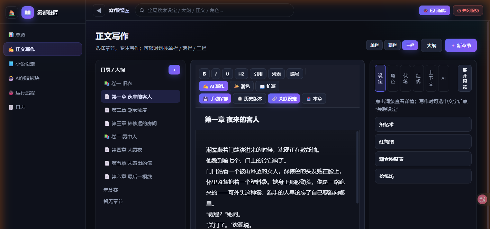

# Novel Studio · 小说创作工坊
> **注意：这是重构后的仓库，你正在看的 `p0-p6` 是重构后的版本（v0.9.3）。**
>
> 重构前的代码在 [`refactor/main`](https://github.com/bbaz123/novel-studio) ，
> 想跑一个稳定版本，请前往main分支。

Novel Studio 是一个本地运行的小说创作管理工具，用于管理多部作品的设定、剧情线、大纲、正文写作，并把 AI 辅助创作能力整合进一个清爽的界面。

它不需要安装任何 npm 第三方依赖，使用 Node.js 内置能力与本地 SQLite 数据库即可运行。你的作品数据、API Key 默认只保存在本机。

**当前版本：v0.9.5（模型统一与修稿提速版，位于下方分支 `refactor/p0-p6`）**

| 仓库 | 地址 | 说明 |
| --- | --- | --- |
| 应用本体 | <https://github.com/bbaz123/novel-studio> | 工坊主程序（本仓库），创作插件源码内置在 `harness-plugins/novel-writing/`，与工坊同仓维护、一起升级 |
| 创作插件 | <https://github.com/bbaz123/novel-writing-plugin> | novel-writing 插件（DeepSeek Harness 创作内核）的独立发布镜像，内容与上面 `harness-plugins/novel-writing/` 同步 |

> 🌿 **先看一下分支，再决定下载哪个**——本仓库有两条线：
>
> - **`refactor/p0-p6`：最新代码（本页描述的即为它）**。含 AI 内核重构 P0–P6：`ai/context/` 上下文装配器、`ai/policy.mjs` 模型策略单点、专用 `novel` dsh profile、`.p1-baseline/` 验证套件等；比 `main` 领先 **33 个提交**。
> - **`main`：已发布版本 v0.9.3**。只想要一个稳定可用的版本，用它就够。
>
> 取最新代码：
>
> ```bash
> git clone -b refactor/p0-p6 https://github.com/bbaz123/novel-studio.git
> ```
>
> （`main` 上的 README 描述的是已发布版本，两处的安装/结构细节会有差异，属正常。）

**第一次用？直接看下面的「⚡ 三步跑起来」**——3 分钟就能开始写。每一步的细节与排错见「🚀 安装与运行（详细步骤）」和 **[docs/新手入门.md](docs/新手入门.md)**。

---

## 👀 它长什么样



打开后是一屏三栏的写作台：

- **左侧导航**：`📚 我的作品`（管理多部作品）、`✨ AI 创作`（用一段描述让 AI 从零生成新书）；进入某部作品后是 `总览 / 正文写作 / 小说设定 / AI创造板块`，下方还有常驻的 `🐞 运行追踪` 与 `🧾 日志`
- **中间正文编辑器**：左侧章节树选章，右侧写正文——富文本排版、自动保存、实时字数统计，工具栏一键调起 `✍️ AI 写作`
- **右侧参考面板**：随手查本章涉及的设定词条、角色卡、剧情线，以及「AI 这次到底看到了什么」的上下文预览（含语义召回命中与相关度）

## ⚡ 三步跑起来（Windows 新手版 · 约 3 分钟）

> **只想自己动手写小说？** 不需要 `npm install`、不需要装数据库、不需要联网、不需要 API Key，也不产生任何费用。
> 唯一要装的东西是 **Node.js**。

### 第 1 步 · 装 Node.js（只需装一次）

打开 <https://nodejs.org> → 下载 **LTS 版**（**22.13 或更高**，推荐直接装最新的 24.x）→ 一路「下一步」装完。

装好后按 `Win + R` 输入 `cmd` 回车，在弹出的黑窗口里敲：

```bash
node -v
```

能看到 `v24.x.x`，或 `v22.13.0` 以上的任意版本，就说明装好了。
**如果版本低于 22.13，请下载新版覆盖安装**——原因见下面「🆘 新手常见问题」里 `node:sqlite` 那一条。

### 第 2 步 · 下载本项目

在本仓库页面点绿色的 **`Code` → `Download ZIP`**，解压到一个**路径里不含中文和空格**的目录，例如 `D:\novel-studio`。

（会用 Git 的话：`git clone https://github.com/bbaz123/novel-studio.git`）

### 第 3 步 · 双击启动

进入解压出来的文件夹，**双击 `start-novel-studio.cmd`**。

它会自动弹出一个黑色服务窗口，并帮你打开浏览器。当服务窗口里出现下面这两行、浏览器里出现「📚 我的作品」页面，就成功了：

```text
[logger:server] Novel Studio 服务启动
Novel Studio is running at http://localhost:3737
```

（两行之间可能还有一行自检日志，属正常现象。若浏览器没自动打开，手动访问 <http://localhost:3737> 即可。）

- 以后每次写作都只要重复**第 3 步**：双击同一个文件。
- 想停止服务：在服务窗口里按 **`Ctrl + C`**（推荐，会先把数据落盘再退出），或直接关掉那个黑色窗口。
- 服务**只监听本机**（`127.0.0.1`），同一局域网里的其它设备访问不到，作品不会被别人看到。

<details>
<summary><b>macOS / Linux 用户点这里</b></summary>

装好 Node 22.13+ 后，在项目目录里执行：

```bash
npm start
```

然后浏览器打开 <http://localhost:3737>；停止服务按 `Ctrl + C`。

</details>

## 🎬 第一次打开，先做这 4 件事

| 顺序 | 做什么 | 怎么做 |
| --- | --- | --- |
| 1 | **导入一本示例小说**（强烈建议） | 首屏「🧪 示例小说」区块 → 点「✨ 一键导入示例小说《雾都缝匠》」→ 再点「打开《雾都缝匠》」。它自带章节、角色、设定词条、长期记忆与事件账本，能让你立刻看懂每个页面是干什么的 |
| 2 | **逛一圈** | 左侧点「总览」看数据统计 → 「正文写作」点章节树里的任意一章，试着改几个字（会自动保存）→ 「小说设定」看剧情线 / 大纲 / 设定库 / 角色 / 长期记忆 |
| 3 | **建自己的作品** | 点左上角「📚 我的作品」回到初始页 → 右上角「新建作品」→ 填书名 → 进入后用「新建章节」按钮就能开写（建议先建一卷；新建章节的对话框里可以指定它属于哪一卷，不指定也能写，会显示为「未分卷」） |
| 4 | **（可选）接入 AI** | 想用 AI 写作 / 续写 / AI 生成大纲，再看「🤖 AI 功能配置」。这一步需要你自己准备模型服务的 API Key，**会产生费用**，不急 |

> 💡 示例小说随时可以删：在「我的作品」页的「🧪 示例小说」区块点「删除示例数据」即可，你自己的作品不受影响。

## 🧭 我该看哪份文档？

| 你的情况 | 直接看 |
| --- | --- |
| **第一次用，只想尽快跑起来** | 本文「⚡ 三步跑起来」；卡住了看 **[docs/新手入门.md](docs/新手入门.md)**（逐步骤讲解 + 逐条排错） |
| 想先知道有哪些功能 | 本文「✨ 功能亮点」 |
| 启动失败 / 报错看不懂 | 本文「🆘 新手常见问题」→ 详细版见 [docs/新手入门.md](docs/新手入门.md) |
| 想接 AI 写作 | 本文「🤖 AI 功能配置」 |
| 想改代码 / 了解 AI 内核与上下文装配 | [docs/ai-core.md](docs/ai-core.md) |
| 想找某份具体文档 | [docs/README.md](docs/README.md)（全部文档索引） |
| 想知道每个版本改了什么 | [docs/CHANGELOG.md](docs/CHANGELOG.md) |

## 🆘 新手常见问题（先看这里）

| 现象 | 原因 | 怎么办 |
| --- | --- | --- |
| 双击 `start-novel-studio.cmd` 后浏览器打不开，或提示「无法访问此网站」 | 服务还没启动完，或启动失败已退出 | 等 5 秒刷新页面；仍打不开，就看那个黑色服务窗口里的报错，对照下面几行 |
| 服务窗口一闪就没了，或提示 `Node.js 22+ is required` | 没装 Node.js，或版本太旧 | 到 <https://nodejs.org> 装 LTS 版后重试 |
| 报错里出现 `node:sqlite`（如 `No such built-in module: node:sqlite`，或提示需要 `--experimental-sqlite`） | Node.js 版本是 22.5 ~ 22.12：这个区间里 `node:sqlite` 还需要额外的 `--experimental-sqlite` 启动参数 | 升级到 **22.13 或更高**（推荐 24 LTS）。官方版本说明：v22.13.0 起该模块不再需要此参数 |
| 报错 `listen EADDRINUSE: address already in use 127.0.0.1:3737` 然后窗口退出 | 3737 端口被别的程序占用了 | 换端口启动：`$env:PORT=3738; npm start`（PowerShell）或 `PORT=3738 npm start`（macOS/Linux）；想知道谁占用了就执行 `netstat -ano`，在输出里找结尾是 3737 的那一行，记下它的进程号（PID）去任务管理器结束 |
| 想换端口 / 换数据目录 | 默认端口 3737，数据在项目里的 `data/` | 用 `PORT=3738` 换端口；用 `NOVELSTUDIO_DATA_DIR="D:\novel-data"` 换数据目录（多开或隔离测试时用） |
| 需要联网吗？要花钱吗？ | — | **手动写作完全不联网、零费用**；只有使用 AI 功能时才会请求你配置的模型服务商并产生费用 |
| 我的作品数据在哪？怎么备份？ | 全部数据都在项目里的 `data/` 目录 | 数据库是 `data/novel.db`（含全部作品与 API Key）。备份请**先关掉服务、再复制整个 `data` 文件夹**——数据库启用了 WAL 模式，只拷 `novel.db` 会漏掉最近的写入（它含密钥，别发给别人） |
| 怎么彻底卸载？ | 程序是绿色免安装的 | 删掉整个项目文件夹即可，系统里不会有残留 |
| 能在手机或另一台电脑上打开吗？ | 服务只监听 `127.0.0.1` | 默认不能。确实需要局域网访问，得自行修改 `server.js` 的监听地址（属进阶改动） |

---

## ✨ 功能亮点

### 作品管理

- 多部作品管理，完整层级：**作品 → 卷 → 章节 / 场景**
- 未进入作品时（初始页），侧栏提供 **「我的作品」** 与 **「✨ AI 创作」** 两个入口
- 作品支持新建、编辑简介、删除
- 一键导入示例小说《雾都缝匠》（演示世界观词条/角色卡/长期记忆/事件账本/反 AI 腔红线），可随时删除

### 重新整理后的侧边栏

进入作品后，左侧只保留几个大栏目，避免界面杂乱：

- **总览**：作品数据总览、最近更新、快捷入口
- **正文写作**：章节树 + 富文本编辑 + AI 写作
- **小说设定**：剧情线、大纲、设定库、角色、长期记忆
- **AI创造板块**：AI 设置、SillyTavern 设置（AI 创作已移到初始页）

### 小说设定板块

集中管理所有与“故事设定”相关的内容，**每个页签都支持 ✨ AI 生成**（AI 会先一次只问一个问题澄清需求，可跳过；自动参考当前作品已有设定，生成后确认/勾选再入库）：

- **剧情线**：主线 + 支线，章节节点时间线预览；支持 ✨ AI 生成（可一次规划多条线勾选入库）
- **大纲**：思维导图 / 列表两种模式，支持卷、章节 / 场景树；支持 ✨ AI 大纲（一次生成整卷“卷+每章标题/摘要”的章节框架，勾选导入）
- **设定库**：分类 + 标签 + 词条详情，支持在正文中关联词条；支持 ✨ AI 批量词条（自动归入/新建分类）
- **角色**：基础档案、外貌、性格、背景、当前状态、人物关系、剧情线级状态；支持 ✨ AI 完整角色卡（含对话示例与系统提示，可多个勾选入库；人物关系/剧情线级状态弹窗也可 AI 回填）
- **长期记忆 / 故事摘要**：记录已发生的重要剧情、伏笔、角色状态变化，AI 写作时会自动带入；支持 ✨ AI 起草记忆与作品/章节作者注起草

### 正文写作

- 富文本编辑：加粗、斜体、下划线、标题、引用、列表
- 自动保存、实时字数统计（统一按纯文本口径，带格式的正文不会虚增字数）
- 单栏 / 两栏 / 三栏布局切换
- 手动保存历史版本，可查看与恢复
- 正文内选中文字可关联设定词条，悬停预览、点击跳转
- 右侧参考面板可快速查看设定、角色与 AI 上下文
- 工具栏「✍️ AI 写作」点击后先弹**需求确认框**（含「直接开始」），确认后才发起付费调用，避免误触扣费

### AI 创作能力

- **入口位置**：AI 自动创建小说 / AI 创作工作台 / 创作任务历史位于**初始页**（未进入作品时，侧栏「✨ AI 创作」）；进入作品后不再显示，专注写作
- **AI 设置**：管理 DeepSeek / OpenAI 兼容 API 配置，支持连接测试（初始页 AI 创作页内与作品内 AI创造板块均可进入）
- **AI 写作 / 续写**：在正文工具栏使用；AI 会先向你提问，一次只问一个问题，根据你的回答继续追问，直到理解需求后再生成正文
- **AI 润色、扩写、细纲、性格校对**
- **AI 自动创建小说**：输入一段描述，AI 自动完善设定并创建作品，创建成功自动进入新书
- **AI 创作工作台 / Harness 流水线**：分阶段生成世界观、角色卡、大纲、正文草稿并做一致性审查，完成后可保存为作品。三档策略（快速 / 均衡 / 深度精修）统一使用 `deepseek-flash`，差异体现在**思考强度**（`low` / `high` / `max`）而不是换模型——V4.1 Flash 在 Agentic/编码基准上已反超 V4 Pro，按“重要环节用旗舰模型”的旧思路反而会把关键环节降级到上一代
- **小说设定 AI 生成**：剧情线 / 大纲 / 设定库 / 角色 / 长期记忆 / 作者注的 AI 生成均复用 **novel-writing-plugin**（deepseek-harness）创作内核——ST 式分层上下文（`/api/novel/context` 装配）、一次一问的澄清协议与反 AI 腔红线
- **入账提案确认**：AI 生成任务里提交的事件/记忆先落提案（不直接写入账本），在「AI 写作结果」弹窗勾选采纳，或到「小说设定 → 长期记忆 → 📥 待确认提案」逐条处理
- **伏笔闭环与一致性核对**：`novel_foreshadows` 查未闭合伏笔、正文回收时自动标记 resolved；成文后 `novel_consistency` 核对未闭合伏笔/角色状态/事件账本；AI 成稿可一键写回章节（旧稿自动存历史版本）
- **任务进度与取消**：所有 Harness 慢通道任务都有悬浮进度卡（阶段文案 / 实时耗时 / 输出尾部），输出已过滤内核内部提示词，只显示人话进度；支持「停止」按钮中途取消（会杀掉 dsh 进程树，已生成内容不落库）
- **SillyTavern 设置**：管理角色卡、世界观词条、作者注，用于丰富 AI 上下文（需进入作品后使用）

### 全局能力

- 全局搜索：设定词条 / 章节正文 / 角色 / 剧情线（正文片段自动剥 HTML 标签，并以查询词为中心截取上下文）
- 本地 SQLite 存储，无需外部数据库服务
- 深色护眼主题

---

## 🚀 安装与运行（详细步骤）

### 第 0 步：环境要求

| 项目 | 要求 | 说明 |
| --- | --- | --- |
| 操作系统 | Windows / macOS / Linux | Windows 可直接用仓库里的 `start-novel-studio.cmd` 一键启动 |
| Node.js | **22.13 或更高**（推荐 24 LTS） | 使用内置 `node:sqlite`，**不需要执行 `npm install`**。注意：22.5 ~ 22.12 里该模块仍需加 `--experimental-sqlite` 参数才能用，所以实际门槛是 22.13 |
| 浏览器 | Chrome / Edge / Firefox 等现代浏览器 | 界面是纯前端页面，无构建步骤 |
| 磁盘 | 约 50 MB（不含作品数据） | 作品数据库位于 `data/`，随使用增长 |

检查 Node 版本：

```bash
node -v      # 需要 v22.13.0 或更高（22.5 ~ 22.12 需额外参数，见「🆘 新手常见问题」）
```

### 第 1 步：获取代码

```bash
git clone https://github.com/bbaz123/novel-studio.git
cd novel-studio
```

不想用 Git 的话，打开仓库页面点 **Code → Download ZIP**，解压后进入 `novel-studio` 目录即可。

### 第 2 步：启动服务

Windows（推荐，自动开服务窗口并打开浏览器）：

```text
双击 start-novel-studio.cmd
```

任意系统（命令行）：

```bash
npm start
# 等价写法
node server.js
```

看到启动日志后，浏览器访问：

```text
http://localhost:3737
```

**换端口**（默认 3737 被占用时）：

```bash
# Windows PowerShell
$env:PORT=3738; npm start

# macOS / Linux
PORT=3738 npm start
```

**换数据目录**（多实例 / 隔离测试）：

```bash
$env:NOVELSTUDIO_DATA_DIR="D:\novel-data"; npm start
```

首次启动会自动创建 `data/novel.db` 与全部表结构，无需手动建库。

### 第 3 步（可选）：创建桌面快捷方式

```powershell
powershell -ExecutionPolicy Bypass -File .\create-desktop-shortcut.ps1
```

会在桌面生成「小说工坊」快捷方式（带图标），双击等同运行 `start-novel-studio.cmd`。

### 第 4 步：配置 AI（要用 AI 创作才需要）

见下文「🤖 AI 功能配置」——在应用内填 Base URL / API Key / 模型即可，密钥只存本地 SQLite。

### 第 5 步（可选）：安装 DeepSeek Harness 与创作插件

只做手动写作不需要这一步；要用「AI 写作 / 创作工作台 / 自动创建小说」这类会调用创作内核（角色卡 / 世界观 / 红线）的功能才需要。

1）准备一份 DeepSeek Harness（dsh）仓库（<https://github.com/deepseek-ai/deepseek-harness>），然后告诉工坊它在哪——**推荐在界面里填**：

```text
✨ AI 创作 → ⚙️ AI 设置 → 🛠 本地创作内核（dsh） → 填路径 → 保存路径
```

保存后立即生效，**不需要设环境变量、也不需要重启服务**；卡上会显示它在不在、构建好没有、按顺序找过哪几个位置。用环境变量也可以（适合脚本化/多实例）：

```bash
# Windows PowerShell
$env:NOVELSTUDIO_DSH_REPO = "C:\path\to\deepseek-harness"
npm start
```

2）安装创作插件。源码就在本仓库 `harness-plugins/novel-writing/`，独立发布仓库为 <https://github.com/bbaz123/novel-writing-plugin>：

```powershell
# 预演（不写任何文件）
powershell -ExecutionPolicy Bypass -File .\harness-plugins\novel-writing\install.ps1 -Profile novel -DryRun

# 安装 / 升级到专用 profile `novel`（novel-studio 后台任务用）
powershell -ExecutionPolicy Bypass -File .\harness-plugins\novel-writing\install.ps1 -Profile novel

# 卸载
powershell -ExecutionPolicy Bypass -File .\harness-plugins\novel-writing\install.ps1 -Profile novel -Uninstall
```

`-Profile` 省略时默认 `headless`。安装做三件事：① 把 GUI preset 复制到
`~/.dsh/.agent-presets/novel-writing/`；② 让目标 profile 在 `dsh.profile.bundles` 里列出
`novel-writing`，并在它的 `node_modules` 下建立指向本仓库的 **junction**——
**工坊仓库即唯一来源，没有副本**；③ 识别并清理旧版"区块合并"安装留下的痕迹（带备份）。

> 自 P0（专用运行时）起，插件不再以"区块合并"方式写进 profile 的 `cordis.patch.yml`，
> 也不再往 profile 目录复制 `novel-tools.mjs`。改完插件代码**立即生效**（走 junction），
> 不需要重跑安装。详见 `docs/ai-core.md` §六。

### 第 6 步（可选）：导入示例作品

首屏「🧪 示例小说」区块可一键导入《雾都缝匠》演示数据（`demo-data.json`），用来熟悉界面。

### 升级到新版本

```bash
git pull
npm start
```

数据库会在启动时自动迁移（新表 / 新列），已有作品不受影响。

### 自检（可选）

```bash
# 插件端到端冒烟（不依赖 dsh / 模型 / API Key）
node harness-plugins/novel-writing/test/smoke.mjs

# 工具配置链离线测试（不连服务器、不碰你真实的 ~/.openviking 与 ~/.dsh）
node env-tools-test.mjs

# 接口回归：需先在 127.0.0.1:3738 起一个隔离实例
node api-test-suite.mjs

# 前端执行验证（最小 DOM 桩里真跑 public/app.js）
node frontend-test.mjs
```

---

## 🤖 AI 功能配置

AI 相关功能需要先配置可用的模型后端。

### 1. 配置 API（在应用内完成）

在初始页（未进入作品）点击侧栏「✨ AI 创作」→「⚙️ AI 设置」；进入作品后也可在「AI创造板块 → AI 设置」配置：

```text
✨ AI 创作 → AI 设置     （初始页）
AI创造板块 → AI 设置     （作品内）
```

新建 API 配置并填写：

- 配置名称
- Base URL（DeepSeek 默认 `https://api.deepseek.com`）
- API Key
- 模型（下拉只有一个推荐项 `deepseek-flash`（DeepSeek-V4.1-Flash，能力最强、单价最低）；其它 OpenAI 兼容服务商的自定义模型名同样兼容）
  - ⚠️ **模型优先级：功能内置的模型参数 > 这里的 `model`**。功能内置分工由
    **`ai/policy.mjs` 单点控制**（P4 起；此前散落在 `public/app.js` 的 12 处硬编码 +
    `server.js` 的同名常量 + `harness.js` 的另一份强度白名单里）。前端经 `GET /api/ai/policy`
    取同一份策略。两个档位**都用 V4.1 Flash**，差别在思考强度：
    - `fast` = `deepseek-flash`，不额外指定强度 —— 提问/澄清、质检轮、入账整理、润色/扩写/细纲/性格校对、**章节正文成文**、批量生成、创作工作台三档；
    - `quality` = `deepseek-flash` + `reasoning_effort: high` —— 结果会喂给之后每一章的环节：AI 审稿、AI 修稿、**设定生成的成文轮**、AI 自动创建小说、长期记忆压缩。
      （2026-09-18 用户决定：这两档过去用「更贵的 `deepseek-v4-pro`」表达质量优先；V4 Pro 已是上一代，改为**同样的模型 + 更多思考预算**，意图不变、成本更低。改动理由与回滚方式写在 `ai/policy.mjs` 文件头。）
    - 因此**改这里的 `model` 不会影响上述功能**；该字段仅对未固定模型的功能生效（当前为连接测试，以及仅供 API 调用的 `/api/ai/generate_novel`）。要调整分工请改 `ai/policy.mjs`。
    - 改完可跑 `node .p1-baseline/verify-ai-branches.mjs` 确认没有绕过策略的散落字面量，
      `node .p1-baseline/test-policy-tiers.mjs` 确认两档模型/强度/超时没被改坏。
  - 已下线或已收敛的模型名不再出现在下拉框中：`deepseek-chat` / `deepseek-reasoner` 官方已于 2026-07-24 停止服务；`deepseek-v4-pro` 于 2026-09-18 并入 V4.1 Flash；`deepseek-v4-flash` / `deepseek-v4-flash-vision-exp` 已由 V4.1 Flash 取代（旧名仍会被服务端路由到 V4.1 Flash）。**存量配置里前三个名字会在启动时自动改写为 `deepseek-flash`**（清单见 `ai/policy.mjs` 的 `LEGACY_MODEL_NAMES`）。
- 温度、最大 Token

### 2. 配置 DeepSeek Harness（可选但推荐）

本项目的 AI 创作 / 深度写作通过 `deepseek-harness`（dsh）执行。若未安装，AI 写作与自动创作可能不可用。

**推荐**：在界面里填一次即可（存本机数据库，重启后仍有效）——`✨ AI 创作 → ⚙️ AI 设置 → 🛠 本地创作内核（dsh）`。
同一张卡上还能看到：它实际用了哪个路径、这个路径是从哪来的、dsh 是否已构建、写作任务的 `DSH_HOME` 是哪。

也可以用环境变量指定 Harness **仓库**所在目录（推荐使用专属变量，避免与 dsh 官方的 `DSH_HOME` profile 目录语义冲突）：

```bash
# Windows PowerShell
$env:NOVELSTUDIO_DSH_REPO = "C:\path\to\deepseek-harness"
npm start

# macOS / Linux
export NOVELSTUDIO_DSH_REPO="/path/to/deepseek-harness"
npm start
```

路径解析顺序（**前者优先**）：`NOVELSTUDIO_DSH_REPO` 环境变量 → 界面里填的路径 → `DSH_HOME`（仅当该目录下存在 `package.json` 时才采用）→ 工坊仓库同级的 `deepseek-harness` 目录。在其它电脑上运行时请按实际路径设置。

> 也就是说：**环境变量优先于界面里填的路径**（脚本化/多实例场景下由 `NOVELSTUDIO_DSH_REPO` 说了算）；界面上的「本地创作内核」卡会如实标出当前用的是哪一层。

> 单轮短任务（润色 / 扩写 / 性格校对 / 细纲等）会优先走「AI 设置」里配置的 API 直连通道（秒级响应），只有需要调用创作内核（角色卡 / 世界观 / 红线）的任务才会经过 Harness 慢通道。

---

## 🧭 界面导航速览

| 入口 | 说明 |
| --- | --- |
| 我的作品 | 未进入作品时默认显示，管理所有小说项目 |
| ✨ AI 创作 | 未进入作品时显示：AI 自动创建小说 / 创作工作台 / 创作任务历史 / AI 设置 |
| 总览 | 当前作品的章节数、设定数、角色数、剧情线数 |
| 正文写作 | 选择章节并写作，支持 AI 写作与富文本排版 |
| 小说设定 | 剧情线 / 大纲 / 设定库 / 角色 / 长期记忆 |
| AI创造板块 | 进入作品后显示：AI 设置 / SillyTavern 设置 |
| 🐞 运行追踪 | 作品内外均可访问：录制开关 + 按操作分组的调用链、Token 汇总、筛选、历史录制回看与导出 |
| 🧾 日志 | 作品内外均可访问：统一日志系统的错误/慢操作/进程异常记录 |

> 顶栏常驻「🐞 运行追踪」按钮可直接开/关录制，不必先进入追踪页；录制中按钮显示「● 录制中」。

---

## 🧩 进阶功能（可选 · 不影响手动写作）

下面三节是给「想接 AI 写作」或「想深挖实现」的人看的，**新手可以整段跳过**：
共享记忆的语义召回、统一日志系统、运行追踪（把界面上的每次操作录成可回看的调用链）。

---

## 🧠 OpenViking 共享记忆（语义召回 · v0.9.0）

工坊与 OpenViking 共享同一个记忆库：六类小说数据（章节正文 / 长期记忆 / 事件账本与伏笔 / 设定词条 / 角色卡 / 大纲剧情线）会自动渲染成 Markdown 写入 OpenViking（`user/default/resources/novel-studio/<作品id>/`），由它的本地 bge Embedding（512 维）向量化，不额外占用一套模型与向量库。

- **语义召回层**：AI 写作上下文装配新增「相关记忆检索（语义召回）」层——写第 N 章时按当前章节/蓝图/最近事件语义召回全库相关片段（top 8、阈值 0.3、预算 1400 字），正文 AI 写作提示词（蓝图/成文/续写）同样注入召回结果；可在写作页参考面板「上下文」页签预览命中与相关度，并可一键开关。
- **增量同步**：保存/删除章节、词条、角色、记忆、事件等会自动防抖同步到记忆库（2s 合并）；服务器离线时进本地 pending 队列自动重放；`POST /api/novel/semantic_index` 可全量重建索引。
- **dsh 双通道共享**：GUI dsh（web profile）与工坊后台 headless dsh 都安装 `@openviking/dsh-memory-plugin`，写作任务会话自动采集进同一记忆库（跨会话可召回）；`harness.js` 会把 headless 任务归属到工坊 peer（`OPENVIKING_PEER_ID`，可用 `NOVELSTUDIO_OPENVIKING_PEER_ID` 覆盖）。
- **检索语义化**：全局搜索与 `novel_lookup` 叠加语义结果（`/api/search` 返回 `semantic.hits`）。
- **环境变量**：`NOVELSTUDIO_OV_DISABLED=1` 整体停用集成（冒烟测试/隔离环境）；`NOVELSTUDIO_OV_AUTOINDEX=0` 关闭启动自动建索引；OpenViking 地址/凭证走 `OPENVIKING_*` 环境变量 → **AI 设置页「OpenViking 记忆库」卡里填的值** → `~/.openviking/ovcli.conf` → `~/.openviking/ov.conf` → 默认 `http://127.0.0.1:1933`
- **在界面里配置（v0.9.4）**：`✨ AI 创作 → ⚙️ AI 设置 → 🧠 OpenViking 记忆库` 可直接填地址/访问令牌并「测试连接」，「保存并生效」当场重建客户端、无需重启；卡上标出**这份凭证当前来自哪一层**。「写入全局配置」会把生效的 `url` + `api_key` 写进 `~/.openviking/ovcli.conf`（**先自动备份、只改这两个字段、其它字段原样保留**；原文件不是合法 JSON 时直接拒绝写入），这样 GUI 会话与写作任务读到的就是同一份凭证——否则容易出现「工坊连上了、AI 写作却召回不到」的错觉。
- **降级**：OpenViking 服务器不可用时语义召回静默跳过，写作与装配完全不受影响。

---

## 🧾 统一日志系统（诊断与性能监测）

工坊内置零依赖日志系统，对**代码运行错误、阻塞卡顿、慢操作、进程异常**等不正常问题全程记录，每条日志都带**发生时间（毫秒级）**、**技术栈层级**（`layer`）、**代码位置**（文件:行号:函数）与**文件地址**（绝对路径）：

- **双写存储**：SQLite `app_logs` 表（侧栏「🧾 日志」页按级别/层级/关键词筛选查看、展开堆栈、一键清空、每 5 秒自动刷新）+ `data/logs/app-YYYY-MM-DD.log` 滚动 JSONL 文件（应用整体卡死/崩溃后重启仍可排查）；保留策略：数据库最新 5000 条 / 30 天，文件 14 天
- **全层覆盖**：`server`（接口 500 与慢请求 >500ms）、`db`、`harness`（任务开始/完成/超时/退出/构建失败）、`ai`（统一 AI 错误，旧 ai_error_logs 自动迁移）、`openviking`/`sync`（记忆库同步失败/队列丢弃）、`plugin`（dsh 插件进程经 `POST /api/logs` 上报）、`frontend`（浏览器运行时错误/未处理 Promise/慢 API/页面卡顿经 `sendBeacon` 上报）、`process`（未捕获异常/未处理拒绝/退出）
- **主动监测**：事件循环滞后采样（卡顿 >400ms 记 `block`，1.5s 以上升级为错误）、慢操作归因（上下文装配/搜索/导出/全量同步超阈值记 `slow_op` 并定位代码位置）
- **防刷屏**：同层同消息 10 秒窗口去重（AI 错误沿用 30 分钟窗口），进程崩溃时先落日志再退出
- **接口**：`GET /api/logs`（筛选+统计+翻页）、`POST /api/logs`（远端上报，仅接受 frontend/plugin 层）、`DELETE /api/logs`（清空）

---

## 🐞 运行追踪（调试录制 · 代码运行可视化）

顶栏「🐞 运行追踪」按钮是一个**录制开关**：点一下开始，再点一下停止。录制期间，你在界面上的每一次操作都会被记成一条**操作记录**，回答三个问题——**这一步跑了哪些代码、在哪一行、花了多久、得到什么结果**。

- **一个操作 = 一条记录**：按业务语义归并。例如点「AI 写本章」是一条操作，它内部触发的上下文装配、AI 调用、红线扫描、保存等 N 次调用都折叠在这一条下面，可展开看完整调用链。
- **前后端同一条时间线**：前端通过 `X-Trace-Op` 头把操作 id 下发给后端，后端用 `AsyncLocalStorage` 让整条异步链归属同一操作，因此「前端处理器 → HTTP 请求 → 路由 → 业务函数 → SQL → 外部调用」按发生顺序排在一起，每个节点都带 `文件:行号:函数名` 与耗时。
- **Token 用量**：直连通道（`/api/ai/*`）逐次采集 provider 返回的 `usage`（输入/输出 token、缓存命中），挂在对应的 AI 节点上，并在操作、会话两级汇总。
- **分层深度**：业务主干函数全量记录；渲染/字符串/数学这类高频工具函数只累计「调用次数 + 合计耗时」，不逐条展开，避免淹没业务链路。
- **落盘与保留**：明细写 `data/debug/trace-<会话>.jsonl`（内存缓冲 1 秒批量追加，崩溃最多丢 1 秒）。会话文件是**自描述**的——开头有 `session-start`、每条操作结束有 `op-end`（含耗时/Token/是否截断的摘要），因此回看不需要额外的索引表；视图内可查看历史录制、导出 JSON；默认只保留最近 20 个会话文件，可一键清空。
- **安全阀**：单次操作节点数超过上限（默认 2000）后停止采集并在界面上标「已截断（丢弃 N 条）」；`/api/debug/*`、`/api/logs`、`/api/stats`、`/api/harness/job` 等自身与轮询接口不参与追踪，避免「记录行为本身」放大负载。
- **忘关保护**：前端每 10 秒心跳一次，页面关闭后后端 20 秒内自动停止录制。

### 明确的边界（先说清楚，避免误解）

- **不记录正文**：所有参数与返回值都只转成「形状摘要」（类型 / 长度 / 字段名 / 关键 id），长文本用长度占位，**绝不落盘小说正文或提示词正文**；写入型 SQL 也只记绑定值的形状（例如"写入了 12480 字的正文"）。
- **慢通道 Token 不可得**：`/api/harness/*` 走的 dsh 子进程里，headless 驱动显式丢弃了 usage 事件（`dsh-headless/lib/index.js` 的 `case "usage": return;`），stdout 只输出正文，因此那条通道只记到任务级（job id / 状态 / 耗时 / 成败），界面上会明确标注这一原因。
- **高频工具函数**合并计数，不逐条列出（见上文「分层深度」）。

### 接口

| 方法 | 路径 | 作用 |
| --- | --- | --- |
| `GET` | `/api/debug/state` | 当前录制状态、实时统计与上限配置 |
| `POST` | `/api/debug/start` / `stop` / `ping` | 开始 / 停止录制、前端心跳 |
| `GET` | `/api/debug/ops` | 当前会话的操作列表 + 工具函数累计表 |
| `GET` | `/api/debug/op?op_id=` | 单次操作的完整调用链（内存优先，回退会话文件） |
| `GET` | `/api/debug/stream` | SSE 实时推送节点（供追踪页边录边看） |
| `POST` | `/api/debug/op` | 前端回传客户端节点、渲染结果与 toast（与后端节点合流） |
| `GET` | `/api/debug/sessions` / `session?file=` | 历史录制列表 / 读取某个会话 |
| `DELETE` | `/api/debug/purge` | 清空全部录制文件 |

### 已埋点的业务主干（函数级节点）

`server.js`：`search`（关键词检索）、`selectSceneCharacters`（选出场角色）、`buildAIContext`（UI 预览上下文）、`scanAgainstRedlines`（红线扫描）、`buildNovelContext`（创作上下文装配）、`compressStoryMemory`（压缩长期记忆）、`splitTextIntoCapters`（导入拆章）、`installDemo`（导入示例）、`callAI` / `callAIStream`（AI 调用，带 Token）。

`ai/context/`：`assemble`（唯一上下文装配器，P2 起）、`renderSection`（单层渲染）。
`ai/policy.mjs`：模型档位与思考强度（P4 起为唯一来源）。

`openviking-sync.js`：`syncWorkFull`（记忆库全量同步）、`getSemanticRecall`（语义召回）、`semanticSearchMerge`（检索合并）。

`harness.js`：harness 任务（会话级，含成功/失败/超时/取消四种结局）。

### 测试

```bash
# 后端接口回归（需要隔离实例在 127.0.0.1:3738 运行）
node api-test-suite.mjs

# 前端执行验证（最小 DOM 桩里真跑 public/app.js：渲染、开关、节点上报、形状摘要）
node frontend-test.mjs
```

---

## 🗄️ 数据与隐私

- 所有数据保存在本机：`novel-studio/data/novel.db`；运行日志位于 `data/logs/`（14 天自动清理）
- 运行追踪的录制明细位于 `data/debug/trace-*.jsonl`（默认保留最近 20 个会话，可在追踪页一键清空）；**其中不包含小说正文与提示词正文**，只含代码位置、耗时与长度等形状信息
- API Key 也只保存在本地 SQLite 数据库中
- `data/` 目录（含数据库备份目录 `data/backup-*` 与 `data/debug/`）已被 `.gitignore` 排除，**不会随仓库上传**
- 首次启动时如果数据库不存在，程序会自动创建所需的表结构

---

## 📁 项目结构

```text
novel-studio/
├── public/
│   ├── index.html      # 页面骨架与侧边栏
│   ├── styles.css      # 样式与深色主题
│   └── app.js          # 前端交互逻辑
├── db.js               # SQLite 初始化与建表（含事件账本/记忆版本/红线/入账提案/app_logs 表）
├── server.js           # HTTP 服务与 API 路由（含 /api/novel/* 创作内核、/api/logs 日志接口）
├── harness.js          # DeepSeek Harness 桥接层（模型切换互斥 + CAS 还原）
├── logger.js           # 统一日志系统（SQLite+文件双写/卡顿与慢操作监测/保留策略）
├── debug-trace.js      # 🐞 运行追踪引擎（AsyncLocalStorage 操作归组/分层埋点/形状摘要/上限截断/JSONL 落盘）
├── openviking.js       # OpenViking 客户端（凭证解析 + 离线 pending 队列）
├── openviking-sync.js  # OpenViking 同步层（六类数据渲染 + 语义召回）
├── text-utils.js       # 共享文本工具（HTML→纯文本，server.js 与 openviking-sync.js 共用）
├── api-test-suite.mjs  # 隔离实例(127.0.0.1:3738) 接口回归测试（零依赖，自清理）
├── frontend-test.mjs   # 前端执行验证（最小 DOM 桩里真跑 public/app.js，零依赖）
├── assets/             # 图标资源（novel-studio.ico 桌面快捷方式图标、preview.png 多尺寸预览）
├── novel-studio-icon.ps1 # 图标生成脚本（渲染 preview / 打包 ico / 应用到桌面快捷方式）
├── demo-data.json      # 示例小说《雾都缝匠》演示数据（“我的作品”页一键导入，可选）
├── harness-plugins/novel-writing/   # 内置创作插件（dsh 侧唯一来源；发布镜像见 novel-writing-plugin 仓库）
│   ├── package.json / cordis.patch.yml # bundle 声明与补丁层（人设 + novel_* 工具 + 瘦身）
│   ├── novel-tools.mjs              # novel_* 工具集（后台任务与 GUI preset 同源）
│   ├── agent.cordis.yml / preset.yml# GUI 会话 preset
│   ├── install-profile.mjs          # profile 接线器（bundles + junction + 旧痕迹清理）
│   ├── install.ps1                  # 安装入口（-Profile/-DryRun/-Uninstall）
│   ├── plugin.json                  # 清单：工具/端点/契约
│   ├── test/smoke.mjs               # 端到端冒烟测试（node:test 风格断言）
│   ├── ENGINE.md / NATIVE_PLUGIN_GUIDE.md / README.md
│   └── headless-cordis.patch.yml    # 【已弃用】旧区块合并片段，仅为对照保留
├── ai/                 # AI 内核（见 docs/ai-core.md）
│   ├── policy.mjs      # 模型档位与思考强度的唯一来源
│   └── context/        # 上下文装配内核：layers.mjs（层规格）+ assembler.mjs（装配器）
├── .p1-baseline/       # 契约基线、压力数据与验证工具（verify-all.mjs 一键跑全部）
├── .p0-recon/          # dsh profile 侧的证据与工具（组合树对账、spawn 路径验证）
├── package.json
├── start-novel-studio.cmd
├── create-desktop-shortcut.ps1
└── data/               # 本地数据库（不会上传到 Git）
```

---

## 📝 更新记录

### 🛠️ 最近更新（2026-09 · 模型统一与修稿提速版 v0.9.5）

- **模型统一为 V4.1 Flash（`deepseek-flash`）**：质量档不再使用上一代 `deepseek-v4-pro`；「质量优先」改由**思考强度**表达（`EFFORT_BY_TIER.quality = 'high'`，随 `GET /api/ai/policy` 下发）。理由与回滚方式写在 `ai/policy.mjs` 文件头（**不要再"顺手恢复"成 v4-pro**：那等于把质量基线静默降成与快档相同）。存量配置里的 `deepseek-v4-pro` 在启动时自动改写为 `deepseek-flash`
- **修稿提速（①：只改被勾选的问题段）**：AI 修稿从"整章重写"改为**补丁式**——模型只输出 `{"patches":[{anchor, revised}]}`，前端逐段定位写回；输出量从「整章长度」降到「改动段落」，配合模型切换把一次修稿从**8–10 分钟**压到一分钟量级。三条底线：畸形 JSON 仍能抢救、**定位不到的改动必须可见**（差异预览里列出，绝不静默）、解析失败自动回退整章重写
- **长任务超时单点化（③）**：新增 `LONG_AI_TIMEOUT_MS = 30 分钟` 并随策略下发，取代散落在前端 11 处 + 服务端 3 处 + harness 默认值的 `600000`；服务端上限 60 分钟不变。此前 10 分钟对"通读整章"偏紧（实测一条修稿跑到 505 秒仍在生成，距超时只剩 95 秒）
- **顺手修掉的静默漂移**：`db.js` 不再抄模型名（改从策略表取，并把"旧名清理清单"收进 `LEGACY_MODEL_NAMES`），`verify-ai-branches.mjs` 的扫描清单补上 `db.js`（此前它漏扫，工具永远报"0 处绕过"）；为 `docs/context-memory-analysis-report.md` 等四份历史报告**加了文首注记**（凡与本页/代码冲突处，一律以当前代码为准——正文按原样保留，作为当时的记录）
- **写作路径提速（实测驱动）**：每条 AI 写作路径的"慢"被拆成可测量的两段——模型生成 + 通道固定开销。实测慢通道（dsh）每个任务多花 **≈17–18 秒**（冷启动 + 智能体循环：微型任务 直连 0.6s vs 慢通道 17.9s；同一条真实蓝图提示词 19.1s vs 47.3s）。据此：
  - **蓝图轮改走直连**（省掉那 17 秒），两道保险：上下文被预算截断时**自动回退慢通道**（只有它能用工具取回被截断的原文）；直连失败/空回复也回退。
  - **直连通道内联"写作纪律"**（反 AI 腔、截断时只依据现有信息、不编造与设定冲突的内容）——慢通道的这部分优势来自插件人设，内联后两条通道纪律对齐（约 250 字，成本可忽略）。
  - **审稿保持慢通道，但把确定性红线扫描预先进提示词**（`POST /api/novel/scan`）：实测慢通道审稿报告里会出现「红线扫描零命中」，那是它调用 `novel_scan` 工具得到的确定性结论；直连没有工具，所以预先算好喂进去，工具优势即被抵消。
  - **修掉直连通道的真实缺陷**：长提示词下 flash 的**思考 token 会把 `max_tokens` 吃光**返回空内容（实测 9k 输入 + 4096/8192 两次都空手而归，`finish_reason=length`）。现在空回复会**压低思考预算（low）+ 放宽输出上限**重试一次，仍为空才回退慢通道。
- **批次 D：静默漂移与死代码清理**：`flushSave()` 未 await（批量生成可能把正在写的新章判成空章并覆盖）；取回结果在非写作视图时**静默 no-op** → 改为落草稿 + 明确提示；`closeModal` 漏清 `pendingAIApply/pendingReviewDiff`；服务端 `plainText` 收敛到 `text-utils.htmlToPlain`（同一章在"检索片段/字数"与"导出/记忆库正文"里文本曾不同）；参考面板的老 AI 写作入口（自带一套上下文拼装、无蓝图/质检/埋点）并入工具栏管线；追踪的 `close` 分支不递减 `pendingRequests`（客户端中止的操作永久 running）；记忆自动压缩触发点收口到两条正文写路径；`PORT` 与 harness-env 语义归一；补齐 `.mt-4`；删除死代码（`describeManifest`/`retrievalOf`/OpenViking `batchWrite` 及其队列分支、`server.js` 5 个死导入、13 个仅内部使用的 `export`）
- **测试自身的两处假象（一并修掉）**：`test-harness-env.mjs` 的"设置文件跟着专用 home 走"是**源码形状断言**，`DSH_SETTINGS` 改名为 `dshSettingsPath()` 后就静默失效了 → 改为**语义断言**（真调函数看它跟随哪一层），并借此发现实现里 `DSH_SETTINGS` 是模块加载期快照、与"每次现算"不一致（已修）；`api-test-suite` 的 L13 隐含假设"作业 1.2 秒内失败"（只在沙箱拦下子进程时成立）→ 改为断言不变量本身并记录实际分支
- **批量生成对齐交互路径的通道策略（每章省 3 次慢通道任务）**：上面「写作路径提速」只改了**交互**写作路径，批量生成那条路一直没跟过来——它每章要跑 **2–4 个慢通道任务**（蓝图 1 + 成文 1 + 字数补足 ≤2），而每任务有 **≈17–18 秒**的冷启动固定开销，10 章就是 **6–12 分钟纯开销**。现在蓝图轮与"小缺口补足"轮改走直连（与交互路径同一套判据与保险）：
  - **蓝图轮直连优先**：上下文被预算截断时**不**走直连（只有慢通道能用 `novel_lookup` 取回被裁掉的原文），直连失败/空回复也回退慢通道。
  - **补足轮按缺口分档**：小缺口（<15%）直连秒级补齐，大缺口才劳驾精写内核。
  - **成文轮刻意不动**：它同时承担事件/记忆入账与一致性核对（`novel_*` 工具），批量时没有人在旁边盯着；改直连就必须另造入账链路，而那条链路会与下一章的作业抢服务端的 2 个并发槽（抢不到就是 429，**提案静默丢失**）。因此这里的取舍是「只把中间产物搬出慢通道，质量链路一个字节不动」。
  - 净效果：每章慢通道任务数 **4 → 1**（典型 1 轮补足时约省 **52 秒/章**，10 章约 **8–9 分钟**）；收尾 toast 现在如实报出**本批用时与平均每章耗时**，让"提速有没有生效"当场可核对（而不是只能事后翻日志猜——长任务此前根本不会被打成 `slow`）。
  - 断言 `110a–110f`（用**相对口径**：慢通道任务数比回退路径正好少一次，不写死绝对次数），并做**双向变异测试**：关掉蓝图直连 → 只有 `110a/110b` 变红；关掉补足直连 → 只有 `110e` 变红。改动前的整文件副本留在 `data/backup-batchspeed-20260918223802/`（含逐字节校验与还原步骤）
- **正文写作主链路的两处修复（质量 + 白等）**：
  - **成文轮补上内联写作纪律**：`WRITING_DISCIPLINE` 此前只内联进**蓝图轮**与**审稿轮**，**成文轮是唯一漏掉的一轮** —— 后果是不对称的：慢通道成文靠插件人设补齐纪律，而直连成文（交互路径的默认通道）既没有人设、也没有内联纪律，只有装配上下文里的【写作风格红线】**词表**。"用具体动作/感官细节/对话潜台词替代模板句"这条**行为**纪律根本没进提示词，README 原先说的"两条通道纪律对齐"其实只在蓝图轮/审稿轮成立。现在三处同源同一份常量。
  - **成文流式直连的空回复不再变成"整章白等 + 报错"**：长提示词下 flash 的思考 token 会把 `max_tokens` 吃光、`content` 返回空（`README` 上文已实测）。`directAIWrite`（蓝图/质检/补足用）早就有"压低思考预算 + 放宽上限"重试，但**成文轮走的是 `streamAIDirectWrite`，它没有重试**——而且服务端此时回的是 `done` + `text:''`，旧实现把空 text 包成一个**真值对象**返回，调用方的 `if (!proseData)` **判不出来**，于是既不重试也不回退精写内核，直接抛"AI 没有返回正文内容"。现在：空回复 → 低思考预算（`low`）+ 更大上限重试一次 → 仍为空才抛错（错误带 `emptyReply`），由既有回退分支接管。**半截流（有正文但没等到 `done`）保持原语义：抛错，绝不把残缺正文当成品交付。**
- **验证**（数字为改动后实测）：前端执行验证 **153/153**、接口回归 **180/180（0 失败 / 0 跳过）**、离线配置链 **36/36**、策略单测 **22/22**、插件冒烟 **36/36**、编码扫描 **862 个文件 0 处非法 UTF-8**、`.p1-baseline/verify-all.mjs` 离线跑批 **36 通过 / 0 未通过 / 8 跳过（跳过=缺活实例或外部仓库，不等于通过）**；其余离线单测（装配器/同步闸门/上下文缓存/记忆护栏/编辑距离/harness 环境/每任务 settings/模型槽位/召回缺口）全绿，AI 分支核对 0 处绕过；迁移用"两次独立进程重开库"实测（v4-pro/chat → flash）；端到端跑在隔离实例上，**黑洞端点收到了真实请求**（证明 `DEEPSEEK_BASE_URL` 生效、零出海计费）
- **批量生成的"红线自检"补上告知**：批量路径此前只取慢通道的 `output`、把服务端已经算好的 `scan` 丢掉了（而交互路径会把它显示在结果弹窗里），于是批量写出来的章节命中了多少反 AI 腔词句**作者永远不知道**（红线自检没有别的展示面）。现在每章写完前对**成文+补足合并后的全文**跑一次确定性扫描（本地正则、零 AI 成本；不复用任务自带的 `scan`——那只是单次调用产出的片段），收尾 toast 如实给出「命中 N 处（章名 …）/ 自检通过 / 自检不可用」三种口径，并把每章命中数写进客户端日志；提案去处指路保持不变。附带：结束后立即刷新「📥 待确认提案」角标
- **第四轮重审**：对本次会话全部改动做了一次独立复核（3 个只读审查切片 + 我自己的逐文件复查），又修掉 10 项问题——其中两处是本轮自己引入的真实缺陷：S2 内联红线扫描**读错了字段名**（`h.word`，服务端给的是 `h.pattern`，提示词里实际是 `undefined×N`）、质量档的 `reasoning_effort` 在 `/harness/job` 入口被**静默丢弃**（"AI 自动创建小说"因此拿不到 high 强度）。完整清单、根因、被推翻的旧结论与防复发规则见 [docs/self-review-2026-09-18.md](docs/self-review-2026-09-18.md)
- **随后修掉的 4 项遗留**（重审报告里如实记为"未修"，之后单独处理）：
  - **修稿的章号归属**：差异预览绑定"这份修稿属于哪一章"，合并写回那一章（此前用"当前打开的章"——修稿要跑几分钟，期间切章会把 A 章的稿整篇写进 B 章）；底稿也按章取（目标章 ≠ 当前章时取那一章**已保存的正文**，不再拿另一章的段落去匹配补丁）；
  - **测试不再动作者实例**：`api-test-suite` 的配置写入段改为 `try/finally` 无条件还原 `ov_endpoint` / `dsh_repo`（此前中途抛错会把实例留在测试值上）；
  - **"跳过"不再冒充"通过"**：新增 `SKIP` 计数，汇总改为「通过 / 失败 / 跳过」，并单独列出未执行的项；
  - **隔离环境补齐**：`gate-env.mjs` 把 `OPENVIKING_CLI_CONFIG_FILE` / `OPENVIKING_CONFIG_FILE` 也指进隔离目录——此前那 4 条"写全局配置"的断言**永远只能跳过**，现在真的执行（实测作者真实的 `~/.openviking/ovcli.conf` 未被触碰）

### 🛠️ 最近更新（2026-09 · 界面内新手引导版 v0.9.4）

刚下载仓库的人不用再读文档、不用设环境变量：**AI 设置页现在能把「完全体」需要的三件事直接在界面里配好**。

- **🧠 OpenViking 记忆库卡**：填地址 / 访问令牌、点「测试连接」即可用，「保存并生效」当场重建客户端（不需要重启服务）；卡上如实显示**这份凭证是从哪来的**（环境变量 / 本页填写 / `ovcli.conf` / `ov.conf` / 默认值），并提供「写入全局配置」——写 `~/.openviking/ovcli.conf` 前自动备份、只改 `url` 与 `api_key`、其它字段原样保留，读不懂的旧文件直接拒绝写入
- **🛠 本地创作内核（dsh）卡**：界面里就能告诉工坊「dsh 装在哪」，并检测它**在不在、构建好没有、像不像 dsh 仓库**；报错会列出按顺序找过的每一个位置。路径解析链：`NOVELSTUDIO_DSH_REPO` → 本页填写 → `DSH_HOME` → 工坊隔壁的 `deepseek-harness`
- **📦 工具与环境清单**：一张表说清 Node.js / dsh / 创作插件 / OpenViking 各自**是干什么的、装没装（真去磁盘看）、不装会少什么、去哪儿装**，命令一键复制；"装没装"来自后端检测，不是写死的文案
- **界面内帮助**：标题旁的小问号（`?`）与字段小字，悬停或键盘聚焦即可看解释——先覆盖新手最容易卡住的术语：SillyTavern、作品/章节作者注、**剧情线↔大纲的关系**、长期记忆↔事件账本、章节蓝图、红线、上下文、直连 vs 慢通道
- **修复：点「查看上次审稿」必报 `plainText is not defined`**（v0.9.3 提交引入的既有缺陷：三处调用了一个**前端从来没有过**的纯文本函数）。改为 `editorPlainText()` —— 基于浏览器原生 `DOMParser`、**保留段落边界**（修稿差异预览按 `/\n{2,}/` 分段，压平会让整章变成一个段落）；并新增**派生式护栏**：前端测试会把仓库所有服务端 `.js` 的函数名收集起来，凡 `public/app.js` 调用却自己没定义的（"幽灵调用"）一律判红——这条护栏经变异测试验证（把 `plainText` 放回去它确实会红，而它的第一版因为读错目录恒为空、假绿）
- **验证**：接口回归 **177/177**、前端执行验证 **76/76**、离线配置测试 **32/32**；本轮验证**零真实模型调用**（隔离实例 + 黑洞端点零连接 + harness 子进程被沙箱拦下）

### 🛠️ 最近更新（2026-09 · 运行追踪版 v0.9.3）

- **🐞 运行追踪（新功能）**：顶栏「🐞 运行追踪」一键开始 / 停止录制，把界面上的每一次操作记成一条记录，回答「这一步跑了哪些代码、在哪一行、花了多久、得到什么结果」——按业务语义归并操作、前后端同一条时间线（`X-Trace-Op` 头 + 后端 `AsyncLocalStorage`）、直连 AI 通道逐次采集 Token 用量、业务主干函数级埋点、高频工具函数只累计次数与耗时；明细写 `data/debug/trace-*.jsonl`（自描述会话文件，默认保留最近 20 个），支持边录边看、历史回看与导出 JSON
- **不记录正文**：所有参数与返回值只落「形状摘要」（类型 / 长度 / 字段名 / 关键 id），绝不写盘小说正文与提示词正文；单次操作节点超上限（默认 2000）自动截断并在界面标注；忘关保护由前端心跳 + 后端 20 秒兜底自动停止
- **长任务续接与结果取回**：AI 写作 / 审稿的成稿草稿与审稿报告一律落库，刷新页面或切换章节后编辑器顶部出现「取回」条——可续接仍在跑的任务，或取回已完成的结果并应用；「已完成未应用」标记统一走「服务端写标记 + 本地列表同步刷新」，不再常驻
- **harness 并发与互斥修复**：`runHarnessJob` / `resumeHarnessJob` 的「检查—置位」竞态窗口用 try/finally 收口（GET 失败等提前 return 也不再泄漏锁）；只有需要改写 `settings.yaml` 的任务才串行，其余并行
- **思考强度可调 + 模型分工校正**：新增 `reasoning_effort`（`off | low | high | max`，进入全局互斥前先校验非法值并给出明确报错）；三档创作工作台统一 `deepseek-flash`，差异体现在思考强度而不是换模型
- **上下文按用途瘦身**：`novel_context` 新增 `settings` 模式（设定类生成只去掉当前场景 / 蓝图 / 前文衔接层，质量层零丢失）；headless profile 关闭与写作无关的通用工具（pwsh / 子代理 / 计划模式 / skill 等），省下的上下文留给创作
- **验证**：接口回归 **147/147**、前端执行验证 **34/34**、插件冒烟 **32/32**；运行追踪另经三轮「追踪记录 × 运行日志」交叉对账复核（见 docs/run-trace-review-round3-2026-09-14.md）

> 📚 更早的更新记录（共 9 条：v0.9.2 及以前）已存档到 [docs/CHANGELOG.md](docs/CHANGELOG.md)。

> 🔧 **AI 内核重构（2026-09-15，未发版）**：上下文装配器与模型策略从 `server.js`/`public/app.js`
> 抽成独立模块（`ai/context/`、`ai/policy.mjs`），后台任务迁到专用 dsh profile。
> **现状说明见 [docs/ai-core.md](docs/ai-core.md)；全部文档索引见 [docs/README.md](docs/README.md)**——
> 注意 `docs/` 里的**历史报告描述的是重构前的代码**，行号已过时。
> 一键跑完**离线**验证：`node .p1-baseline/verify-all.mjs`（需要活实例或外部仓库的检查会明确标成「跳过」，
> 跳过不等于通过；数字与命令见上一条「验证」）。

---

## ⚠️ 注意事项

- 请勿将 `data/novel.db` 直接分享或上传，其中可能包含你的 API Key 与作品内容
- AI 请求会发送到你配置的模型服务商；如使用云端服务，请注意敏感信息
- 若修改了 `server.js` 或 `db.js`，重启服务后生效
- 本项目基于 DeepSeek Harness（dsh）的 AI 能力开发，有问题请直接询问 dsh
- 应用本体仓库：<https://github.com/bbaz123/novel-studio>
- 创作插件仓库（发布镜像）：<https://github.com/bbaz123/novel-writing-plugin>
- 借鉴开源项目：SillyTavern，利用其世界观等特色加深 AI 写作能力
